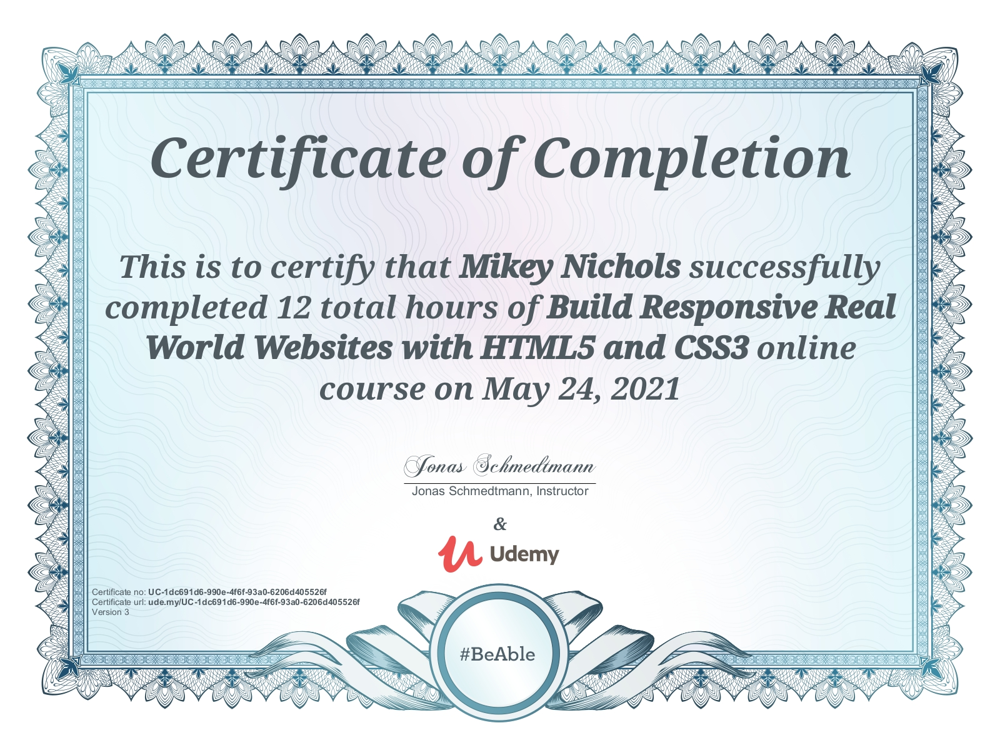

# Build Responsive Real World Websites with HTML and CSS

Completed in but retaking for clarity

## Course Outline

1. Welcome & First Steps
2. HTML Fundamentals
3. CSS Fundamentals
4. Building Layouts
5. Web Design Framework
6. Components and Layouts
7. Omnifood: Desktop
8. Omnifood: Responsive
9. Omnifood: Optimizations

## High-Level Overview of Web Development

* A Browser trying to access a website will send a request to a web server
* When the server receives that request, it will package up  all of the files that it needs to render the page back to the browser that requested it
* The browser will put those files together and are usually HTML, CSS, or Javascript

## CSS Fundamentals

* CSS means Cascading Style Sheet. Just like HTML, CSS is one of the core technologies of the Web.
* CSS describes the visual style and presentation of the content written in HTML
* CSS and HTML work closely together

## CSS Rule

* A selector like `h1` or `p` followed by a declaration block `{someProperty: value}`
* We can write CSS in three ways.
  Internally - Good for temporary fixes
  Inline - Really never ideal
  Externally - Ideal
* We can style text using many properties

## Combining Selectors

We can refactor our code in a way that allows us to follow DRY principles by combining similar styles into a parent element, or even creating a list of selectors like this: `h1,h2,h3{}`

## Class and ID Selectors

We can style certain containers based on their class or ID by using a `.` or a `#`

* `.` will apply styles to a class
* `#` will apply styles to an id

We can comment in css using /\* comments go here\*/

* We must use classes if we intend to reuse the same style more than once. IDs should only be used once within a document
